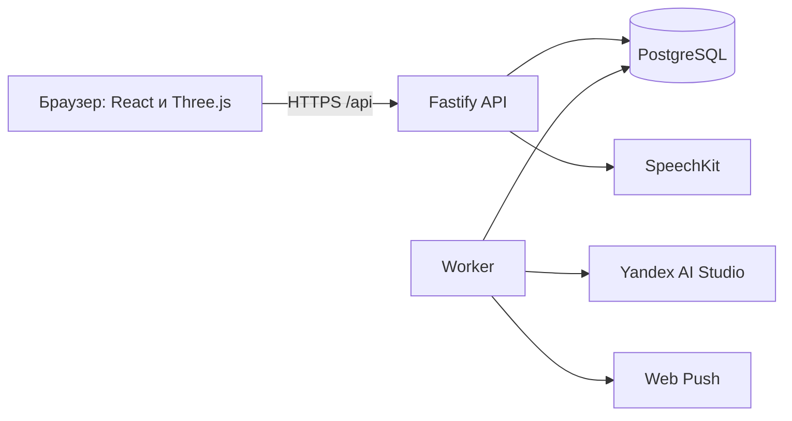
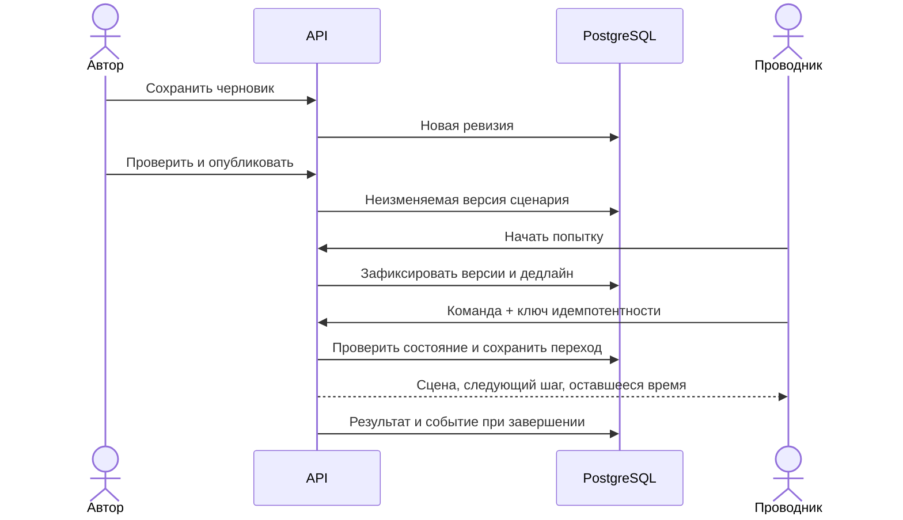

# Архитектура

React/Vite отвечает за интерфейс, Three.js — за вагон и персонажей. Fastify выполняет команды и проверяет права, время, условия переходов и начисление баллов. PostgreSQL хранит состояние; worker обрабатывает диалоги и события.

## Модули

| Модуль | Ответственность |
|---|---|
| Вход и права | Сессия в HttpOnly cookie, регистрация, роли |
| Редактор | Черновики, проверка графа, публикации, ИИ-помощник |
| Игра | Попытки, ответы, действия и перемещения в 3D, таймеры |
| Кабинет и прогресс | Сохранённые результаты, достижения, профиль |
| Рейтинг | Лучшие результаты за последние 720 часов |
| Материалы | Опубликованные учебные карточки и источники |
| Уведомления | Inbox, Web Push, фильтры и очистка |

Модули имеют серверные переключатели. Отключение не удаляет данные. Кабинет читает сохранённые результаты при выключенной игре; опубликованная игра работает при выключенном редакторе.

## Публикация и прохождение

Сценарий задаётся графом. Узлы содержат ситуации, ответы, действия и исходы; рёбра — условия переходов. 3D-привязки задают вагон, координаты пассажира, точки и предметы. Маршрут объединяет малые сценарии и выбирает следующий по условиям.

Состояние игры, дедлайны, команды и результаты находятся в БД. Повтор команды возвращает прежний результат. Публикация новой версии не меняет начатую попытку. API можно запускать в нескольких экземплярах, worker — отдельно; задания захватываются через lease и блокировки PostgreSQL.

## ИИ и голос

Модель возвращает ограниченный структурированный ответ. Права, расстояние до цели, инвентарь, переходы и баллы проверяет сервер. Работа провайдера выполняется вне длительных транзакций. Очередь сохраняется при перезапуске worker. Ошибка провайдера не подменяется успешным игровым действием.

Дополнительные схемы: [система](../apps/api/docs/diagrams/01-system.svg), [модули](../apps/api/docs/diagrams/02-modules.svg), [данные](../apps/api/docs/diagrams/03-data.svg), [игра](../apps/api/docs/diagrams/04-game.svg), [ИИ](../apps/api/docs/diagrams/05-ai.svg).
